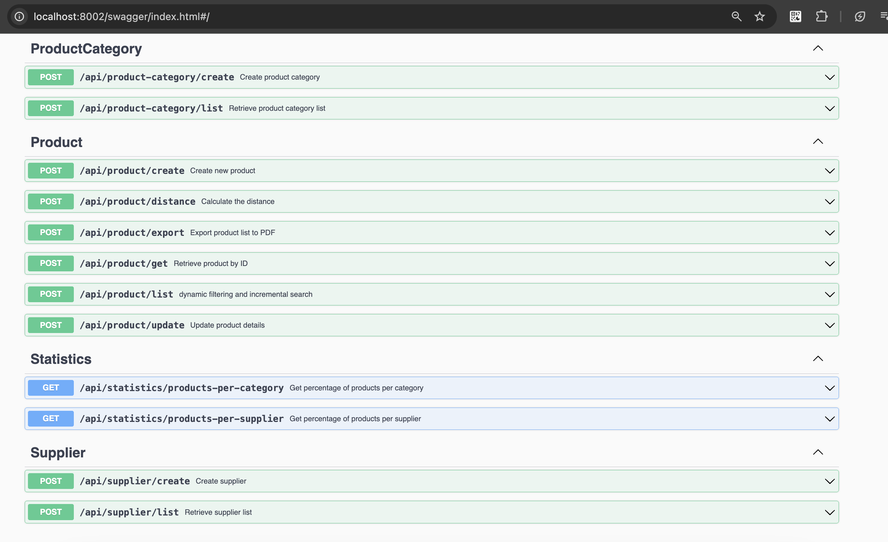

## 1. Run Locally with Docker - Setup Instructions

Update the PostgreSQL and Redis connection configurations in `./config/local.yaml`, then follow these steps:

1.  Build the Docker containers:
    ```sh
    docker compose build
    ```
2.  Start the containers:
    ```sh
    docker compose up -d
    ```
3.  Open [Swagger UI](http://localhost:8002/swagger/index.html)
     or [Swagger YAML file](docs/swagger.yaml)

## 2. Logging

Log files are stored in the `./storage/logs/` directory.

## 3. Redis Keys

- `category_products:{categoryID}` - Stores the total number of products for a given category.
- `supplier_products:{supplierID}` - Stores the total number of products for a given supplier.
- `product_total` - Stores the total number of products.

## 4. Product Creation Flow

1. Check if the product and category exist in Redis to reduce database access:
   - `category_products:{categoryID}`
   - `supplier_products:{supplierID}`
     If the data is not available in Redis, retrieve it from the database.
2. If the product exists, create the new product and increment the corresponding Redis keys.

## 5. Distance Calculation from IP to Stock Location City

By default, the system retrieves the IP address from the request header. However, for testing purposes, you can pass the IP address in the request body. If `body.ip` is empty, the system will use the IP from the request header.
The system utilizes the following services:

- **Nominatim (OpenStreetMap)** - Converts city names into coordinates and retrieves addresses from coordinates.
- **ip-api.com** - Retrieves coordinates based on an IP address.
  Both services are free but may not be 100% accurate.
